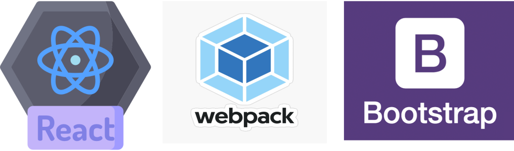

# Lobby Team Test Task

Develop a responsive website, for a fictional casino company according to the listed Technical and Functional Requirements below.
Main
● React
    oCreate-react-app and NX are not allowed! (no quick setup tools)
● Redux Saga
● TypeScript
● Webpack
● SCSS
    o MUI styling libraries are allowed
● Material-UI
● Responsiveness

Nice to have
● React router
● Latest node version (20)
● Libraries have the latest version

# Installation and Setup Instructions:

Clone down this repository. You will need node and npm installed globally on your machine.

Installation:
**npm install**

To Start Server:
**npm start**

# Project Overview

This project is built using React, configured with Webpack for module bundling. To streamline development, especially as I'm currently not any experinced in TypeScript, I opted to integrate Bootstrap. This choice allows me to focus on functionality and design without the steep learning curve of TypeScript for now.

Key Features:
    Responsive Design: The website is fully responsive, ensuring a seamless user experience across various devices and screen sizes.

Technologies Used

React: A JavaScript library for building user interfaces.
Webpack: A module bundler used to compile JavaScript modules.
Bootstrap: A front-end framework used for designing websites and web applications.

Project Goals

The primary goal of this project is to deliver a fully functional and responsive website. By using Bootstrap, I aim to implement a robust layout and design quickly and efficiently, ensuring that I can focus on functionality and meeting project deadlines without being hindered by my current learning curve with TypeScript.

Ps: After completing task i have decided to improve coding with useContext, layout structure created a second project on Sunday. Just Favorites not finished yet. Link:
https://github.com/01alp/g2.git
 
